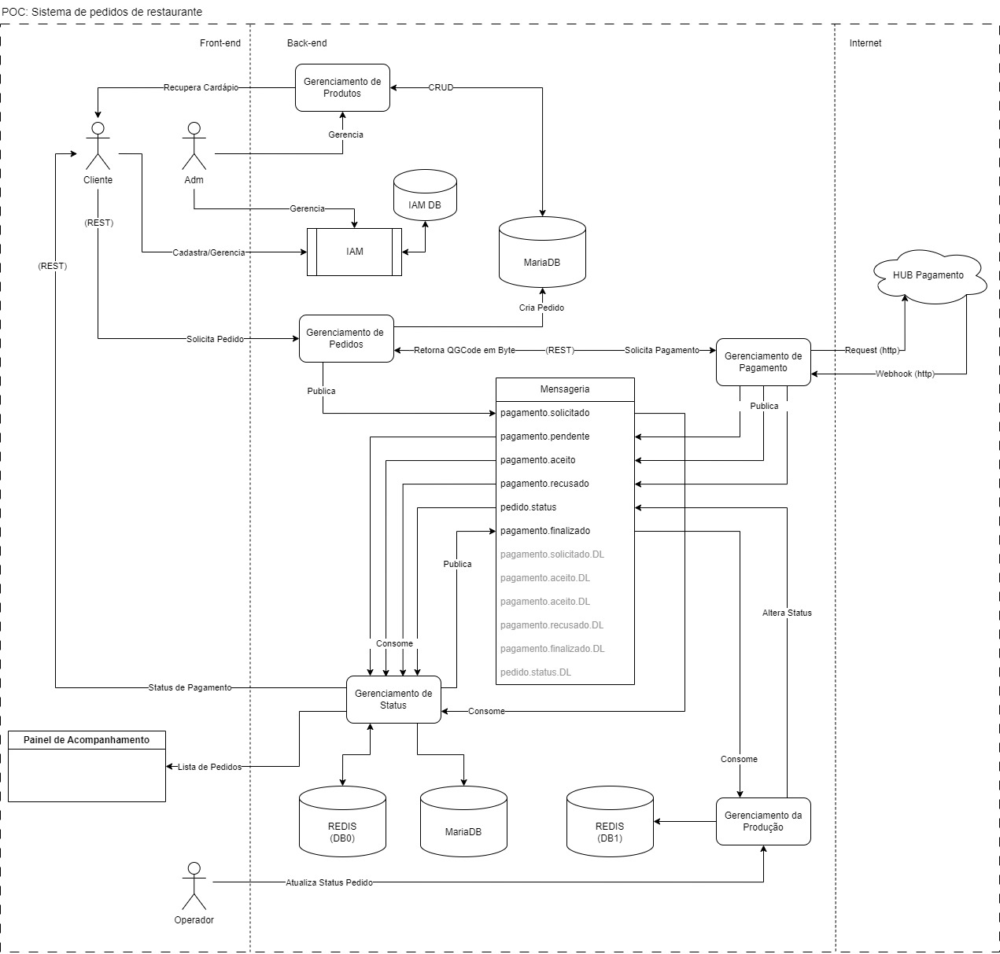

# FIAP 2023 - Pós Tech - Tech Callenge - Entrega Final - SOTA 2 - Grupo 36

## Arquitetura
O diagrama abaixo representa a arquitetura do sistema de gerenciamento da lanchonete, focado nos domínios de Pedidos realizados pelos clientes, Pagamento dos pedidos resliazado e Contorle de Status dos pedidos.

A escolha do padrão SAGA Coreografado foi baseada na observação de que são domínimos  com regras de negócio relativamente simples e contidas, não proporcionando um forte acoplamento entre os serviços. Parte de desacoplamento foi realizado tentando ao máximo aplicar a regra da "responssabilidade única" dos microserviços, onde somente um microserviço é espaecializado em gerenciar/alterar um conjunto muito pequeno (depreferência uma só) de propriedades do fluxo de negócio.

Outro ponto que nos levou a essa arquitetura é que o time evolutivo dessa aplicação é pequeno e está sobre a mesma gestão de projetos e é atendido pelo mesmo QA e BA, com isso o contexto, documentação e comunicação entre os desenvolvedores ocorre natualemnte.

A arquitetura é focada em distinguir e apresentar rapidamente os erros e falhas e execução usando conceitos de "dead letter queues" onde pode-se destacar desenvolvedores/analistas da equipe epecíficos para tratar o domínio de "autorecuperação da plataforma". Essa configuração de arqiutetura e equipe impede e trata situações como dependências cíclicas, "dirt reads", atualizações perdidas, adotando contramedidas em um conjunto separado de microserviços, não sobrecarregando os microserviços "core" e desacoplando os fluxos e estados da aplicação.

A infraestrutra é composta por:
* Aplicação de IAM
* Aplicação de Menssageria
* Banco de dados Realcional
* Banco de dados Chave-Valor
* Microserviço de gerenciamento de Produtos
* Microserviço de gerenciamento de Pedidos
* Microserviço de gerenciamento de Pagamentos
* Microserviço de gerenciamento dos Estados dos Produtos
* Microserviço de gerenciamento da Produção

## OWASP ZAP
### Relatórios de análise de vulnerabilidades
* Relatórios microserviço de Pedido:
    * [Exibir Cardápio](https://github.com/GuilhermeOCamargo/tech-challenge-product-api/blob/main/reports "Pré e Pós OWASP ZAP")
    * [Realização Pedido](https://github.com/GuilhermeOCamargo/tech-challenge-product-api/blob/main/reports "Pré e Pós OWASP ZAP")
    * [Geração Pagamento](https://github.com/juliapcosta97/tech-challenge-payments/tree/main/owasp "Pré OWASP ZAP")
    * [Confirmação Pagamento](https://github.com/juliapcosta97/tech-challenge-payments/tree/main/owasp "Pré OWASP ZAP")

## LGPD
* [Relatório RIPD](./lgpd/readme.md "RIPD").

## Vídeo de funcionamento
[Acesso ao vídeo (Google Drive)](https://drive.google.com/file/d/1JZMzE6eQPcJU0ELPOLEfl0sAU74fAltR/view?usp=sharing "SAGA Coreografado")
* Índice
    * 00:00 - 00:22 : Apresentação do Grupo
    * 00:23 - 02:30 : Visão geral da Arquitetura
    * 02:31 - 04:02 : Visão geral do fluxo de cadastro de clientes e autorização/autenticação
    * 04:03 - 06:39 : Visão geral do fluxo de gerenciamento de produtos
    * 06:40 - 08:14 : Visão geral do fluxo de gerenciamento de pedidos
    * 08:15 - 10:21 : Visão geral do fluxo de gerenciamento de pagamentos
    * 10:22 - 16:05 : Visão geral do fluxo de gerenciamento dos estados do pedido
        * 12:57 - 14:58  : Visão geral do uso e arqitetura das dead letter queues 
    * 16:06 - 18:20 : Visão geral do fluxo de gerenciamento dos estados do pedido
    * 18:21 - 25:47 : Explicação e defesa (simplificada) das decisões de definição da arquitetura
    * 25:48 - 52:56 : Demontração do funcionamento da aplicação na Arquitetura proposta
        * 29:30 - 33:06 : Explicação de como e porque fazer a identificação escaracterizada do usuário 
        * 40:12 - 41:43 : Gerando um erro no fluxo e demonstrando a reação (bloqueio) da aplicação
        * 43:13 - 50:03 : Demonstação de alguns posíveis casos de uso das dead letter queues
        * 50:04 - 51:40 : Realizando o login no IMA para proceder request de Admin
    * 52:57 -  53:07 : Fechamento e Agradecimento

## Repositórios dos microserviços
* [Gerenciamento de Produtos](https://github.com/GuilhermeOCamargo/tech-challenge-product-api "tech-challenge-product-api")
* [Gerenciamento de  Pedidos](https://github.com/felipeksw/tech-challenge-fiap-order "tech-challenge-fiap-order")
* [Gerenciamento de Pagamento](https://github.com/juliapcosta97/tech-challenge-payments "tech-challenge-payments")
* [Gerenciamento de Status](https://github.com/felipeksw/tech-challenge-fiap-followup "tech-challenge-fiap-followup")
* [Gerenciamento da Produção](https://github.com/rodJeronimo/tech-challenge-fiap-production "tech-challenge-fiap-production")

## Prova de Conceito
Para executar a aplicação de forma local, você deverá ter o Docker instalado um uma máquina, executar primeiro os "docker composer" da infra, individualmente:
* [Kafka](./poc/infra/kafka/docker-compose.yaml)
* [Keycloak](./poc/infra/keycloak/docker-compose.yaml)
* [MariaDB](./poc/infra/mariadb/docker-compose.yaml)
* [Redis](./poc/infra/redis/docker-compose.yaml)

Após a verificação da execução dos componentes da infra deve-se configurar o hostname e token do Mercado Pago para a execução da aplicação no arquivo de configuração:
* [.env](./poc/.env)

 Com as variáveis de ambinete configuradas, executar o "docker compose" dos microserviços da solução:
* [Gerenciador de Padidos da Lanchonete](./poc/docker-compose.yaml)

ATENÇÃO: verificar se as portas "ocupadas" na máquina que irá executar a infra e as aplicações estão diponíveis
* [Lista de portas e informações adicionais para a PoC](./poc/README.md)