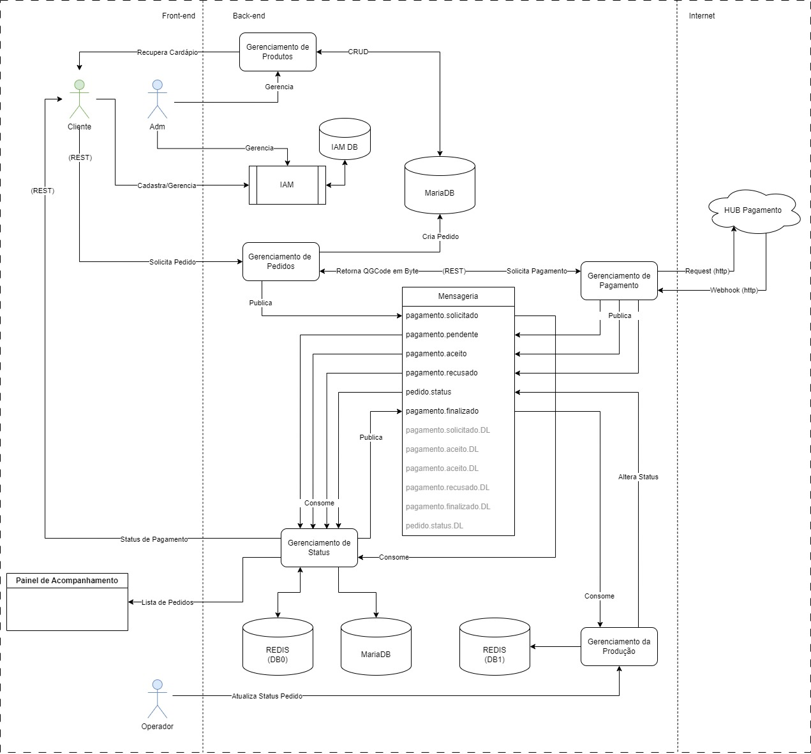

# FIAP 2023 - Pós Tech - Tech Callenge - Entrega Final
* SOTA 2 - Grupo 36

# Entregáveis
## Arquitetura
O diagrama abaixo representa a arquitetura do sistema de gerenciamento da lanchonete, focado nos domínios de Pedidos realizados pelos clientes, Pagamento dos pedidos resliazado e Contorle de Status dos pedidos.

A infraestrutra é composta por:
* 
*
*

## OWASP ZAP
### Relatórios Pré correção de vulnerabilidades
* [Exibir Cardápio](./zap/ "Pré OWASP ZAP")
* [Realização Pedido](./zap/ "Pré OWASP ZAP")
* [Geração Pagamento](./zap/ "Pré OWASP ZAP")
* [Confirmação Pagamento](./zap/ "Pré OWASP ZAP")

### Relatórios Pós correção de vulnerabilidades
* [Exibir Cardápio](./zap/ "Pós OWASP ZAP")
* [Realização Pedido](./zap/ "Pós OWASP ZAP")
* [Geração Pagamento](./zap/ "Pós OWASP ZAP")
* [Confirmação Pagamento](./zap/ "Pós OWASP ZAP")

## LGPD
* [Relatório RIPD](./lgpd/readme.md "RIPD").

## Vídeo de funcionamento
*

## Repositórios dos microserviços
* [Gerenciamento de Produtos](https://github.com/GuilhermeOCamargo/tech-challenge-product-api "tech-challenge-product-api")
* [Gerenciamento de  Pedidos](https://github.com/felipeksw/tech-challenge-fiap-order "tech-challenge-fiap-order")
* [Gerenciamento de Pagamento](https://github.com/juliapcosta97/tech-challenge-payments "tech-challenge-payments")
* [Gerenciamento de Status](https://github.com/felipeksw/tech-challenge-fiap-followup "tech-challenge-fiap-followup")
* [Gerenciamento da Produção ???](https://github.com/????? "????")

